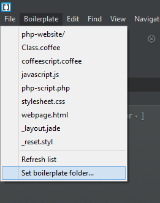
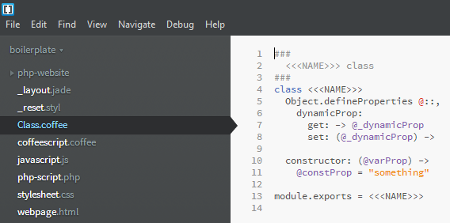

brackets-boilerplate
====================

Quickly copy boilerplate files into your project in Brackets with this extension.

Installation
------------
As this is an extension for Brackets you obviously need to have [Brackets](http://brackets.io/) installed.

 1. Open the extension Manager.
 2. Search for "brackets boilerplate".
 3. Install the extension.
 4. Profit! :)

Usage
-----
A new Boilerplate menu will appear on the menu bar. From here you can choose
any folder to use as your boilerplate collection. The menu will then be
populated with all the files and folders in the selected folder.

When selecting a boilerplate file or folder from the menu, it will get copied
into the currently selected folder in the tree. If you omit the file suffix it
will get automatically reattached. If the boilerplate file (or any file in the
boilerplate folder) contains the string `<<<NAME>>>`, it will get replaced with
the given filename without suffix.

